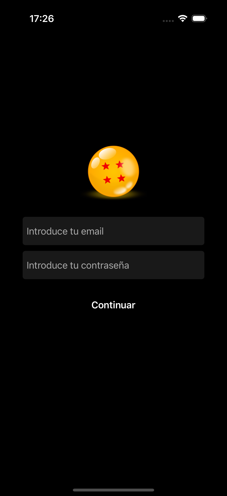
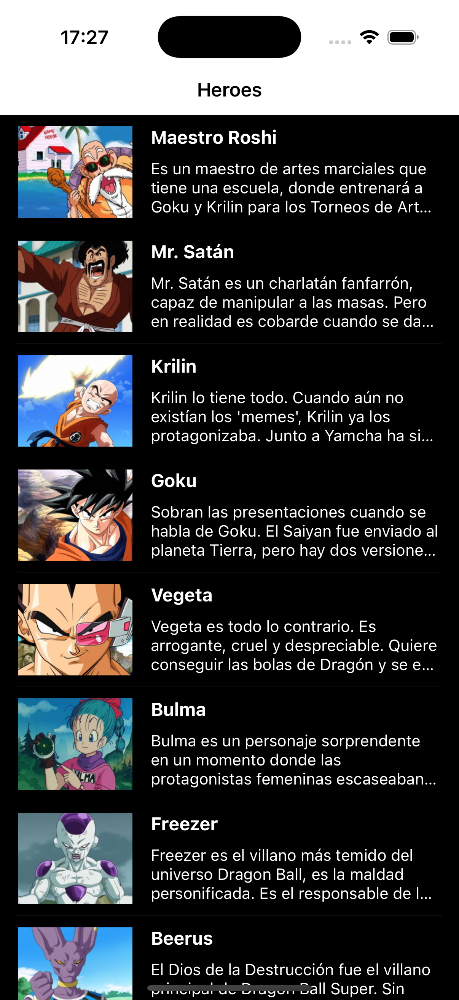
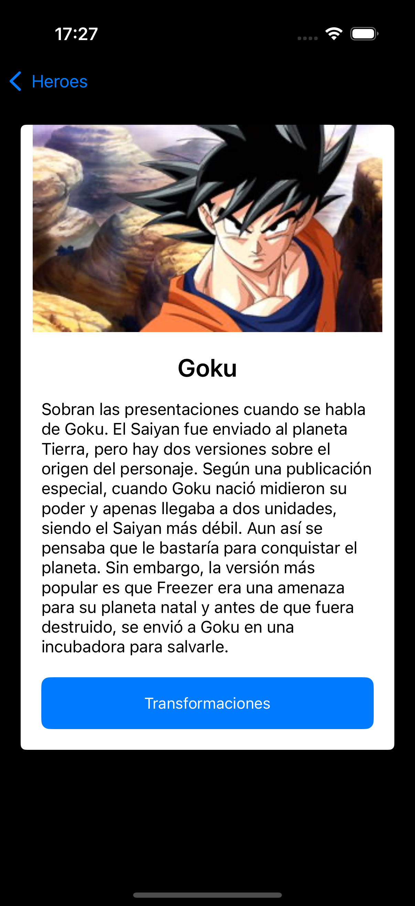
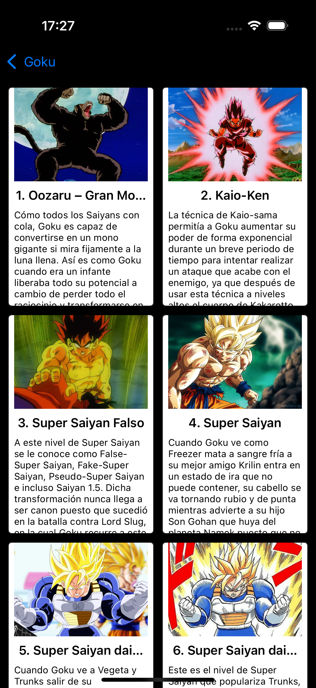

# DragonBall Heroes
DragonBall Heroes es una aplicación iOS que permite a los usuarios explorar los personajes del universo Dragon Ball y sus transformaciones. La aplicación consume una API REST para mostrar información sobre los héroes y sus distintas formas.

## Screenshots

  

    

      
      
Login

    

    

      
      
Lista de heroes

    

    

      
      
Detalles del heroe

    

    

      
      
Transformaciones

    

  

## Especificaciones
- **Credenciales**:
  - Email: tu dirección de email
  - Password: tu contraseña
- **Arquitectura**: MVC (Model-View-Controller)
- **Interfaces**: XIBs y UI programática

## Requisitos Completados
### Funcionalidades Básicas ✅
- Sistema de login con autenticación
- Listado de héroes con imágenes y descripciones
- Detalle de héroe con información completa
- Visualización de transformaciones para cada héroe
- Navegación entre pantallas

### Funcionalidades Técnicas ✅
- Consumo de API REST con tokens de autenticación
- Carga asíncrona de imágenes
- Manejo de estados de carga y errores
- Interfaces programáticas y con XIBs
- Unit Tests para la capa de modelo

### Arquitectura ✅
- Patrón MVC (Model-View-Controller)
- Separación clara de responsabilidades
- Servicios de networking centralizados
- Modelo de datos completo

## Consideraciones y Comentarios
### Arquitectura del Proyecto
El proyecto está organizado en las siguientes carpetas:
- `Models`: Definiciones de datos (Hero, Transformation)
- `Controllers`: ViewControllers para cada pantalla
- `Views`: Células personalizadas y componentes de UI
- `Networking`: Servicios de comunicación con la API
- `Helpers`: Utilidades y herramientas comunes
- `Tests`: Pruebas unitarias para el modelo

## Dificultades Encontradas
### Principales Desafíos
1. **Problemas con XIBs y layouts que llevaron a una UI programática**
   - Dificultades frustrantes con la conexión de outlets y actions
   - Problemas recurrentes con constraints y layouts inconsistentes
   - Decidí cambiar a un enfoque programático para la UI, resultando en una implementación más predecible
   - **Área de mejora**: Profundizar en el manejo de Auto Layout y constraints para crear interfaces más robustas

2. **Testing y mocks**
   - Implementación de tests unitarios básicos pero con dificultad para crear mocks eficientes
   - Reto importante para entender los conceptos de testing en Swift
   - **Área de aprendizaje**: Ampliar conocimientos en testing, dependency injection y creación de mocks

3. **Consumo de API y Autenticación**
   - Implementación del flujo de autenticación
   - Manejo de tokens para requests subsecuentes
   - Procesamiento de respuestas JSON

4. **Interfaz de Usuario y Experiencia**
   - Diseño responsivo para diferentes dispositivos
   - Animaciones y transiciones
   - Manejo de estados de carga y errores

## Instrucciones de Uso
1. Iniciar la aplicación
2. Ingresar credenciales en la pantalla de login
3. Explorar la lista de héroes de Dragon Ball
4. Seleccionar un héroe para ver su detalle
5. Si el héroe tiene transformaciones, se mostrará un botón para verlas
6. Seleccionar una transformación para ver sus detalles

## Componentes Principales
- **LoginViewController**: Maneja la autenticación del usuario
- **HeroesTableViewController**: Muestra la lista de todos los héroes
- **HeroDetailViewController**: Muestra información detallada de un héroe
- **TransformationsCollectionViewController**: Muestra las transformaciones de un héroe
- **NetworkModel**: Gestiona todas las llamadas a la API
- **DataFetcher**: Centraliza las operaciones de datos

---
# 🔄 Lo Que Me Llevo de Este Proyecto 🔄
> ### 🏗️ *Patrones y Estructuras*
> - Desarrollo de interfaces con UI programática
> - Consumo de APIs REST con autenticación
> - Manejo de imágenes asíncronas
> - Navegación entre controladores
> 
> ### 📐 *Arquitectura*
> - Patrón MVC en aplicaciones iOS
> - Separación de responsabilidades
> - Introducción al testing de modelos de datos
> - Manejo de estados de UI
> 
> ### ✅ *Áreas de Mejora y Aprendizaje*
> - **Testing**: Profundizar en unit testing, mocks y test-driven development
> - **Layouts y Constraints**: Perfeccionar el uso de Auto Layout para interfaces más robustas
> - **Gestión de Memoria**: Mejorar el entendimiento de retain cycles y memory management
> - **Patrones de Diseño**: Explorar más allá de MVC (MVVM, Clean Architecture)
---
